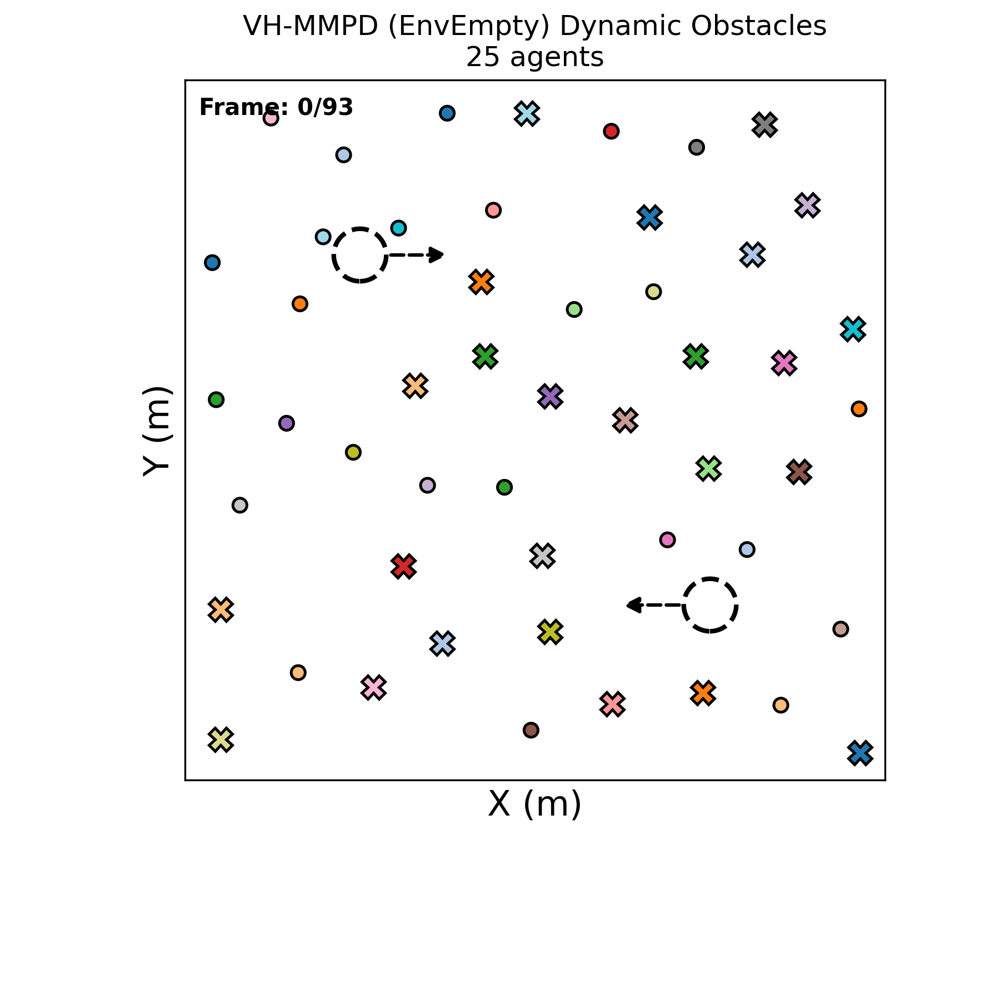
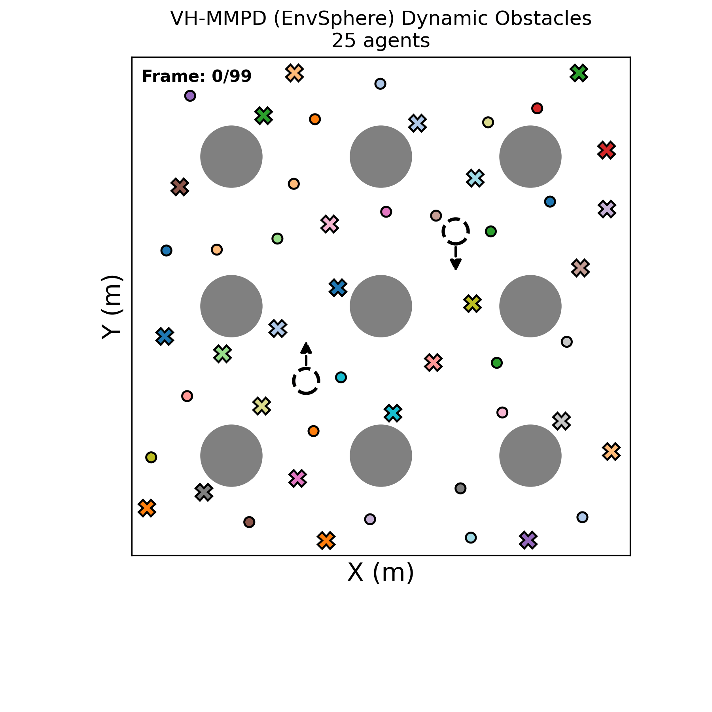
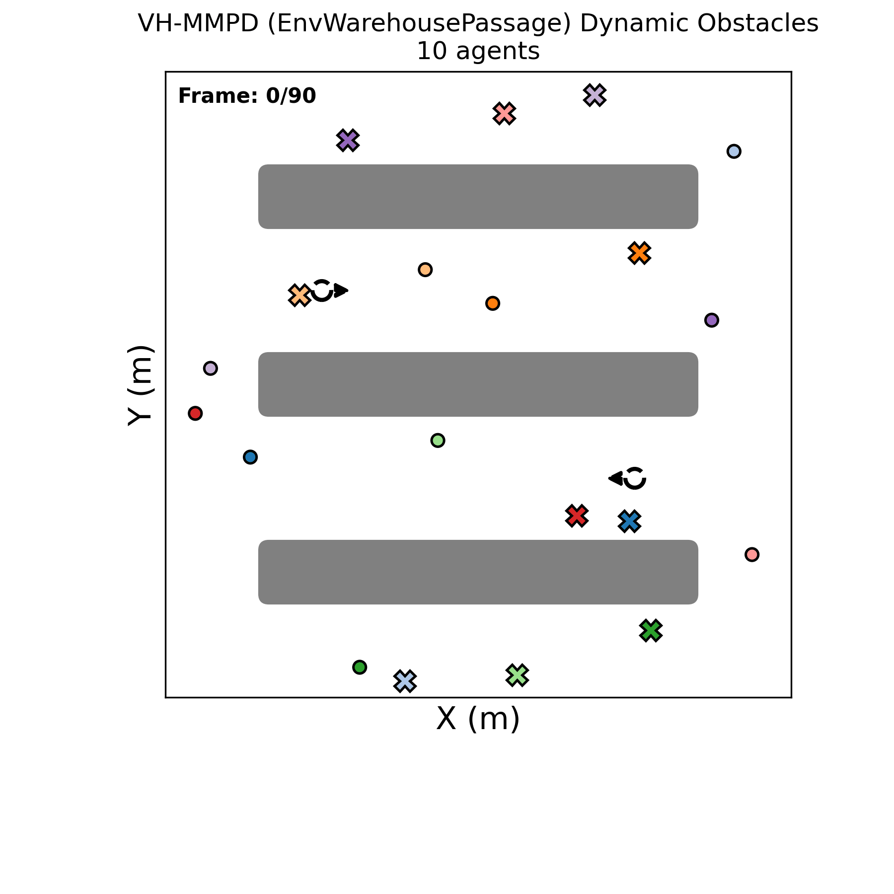
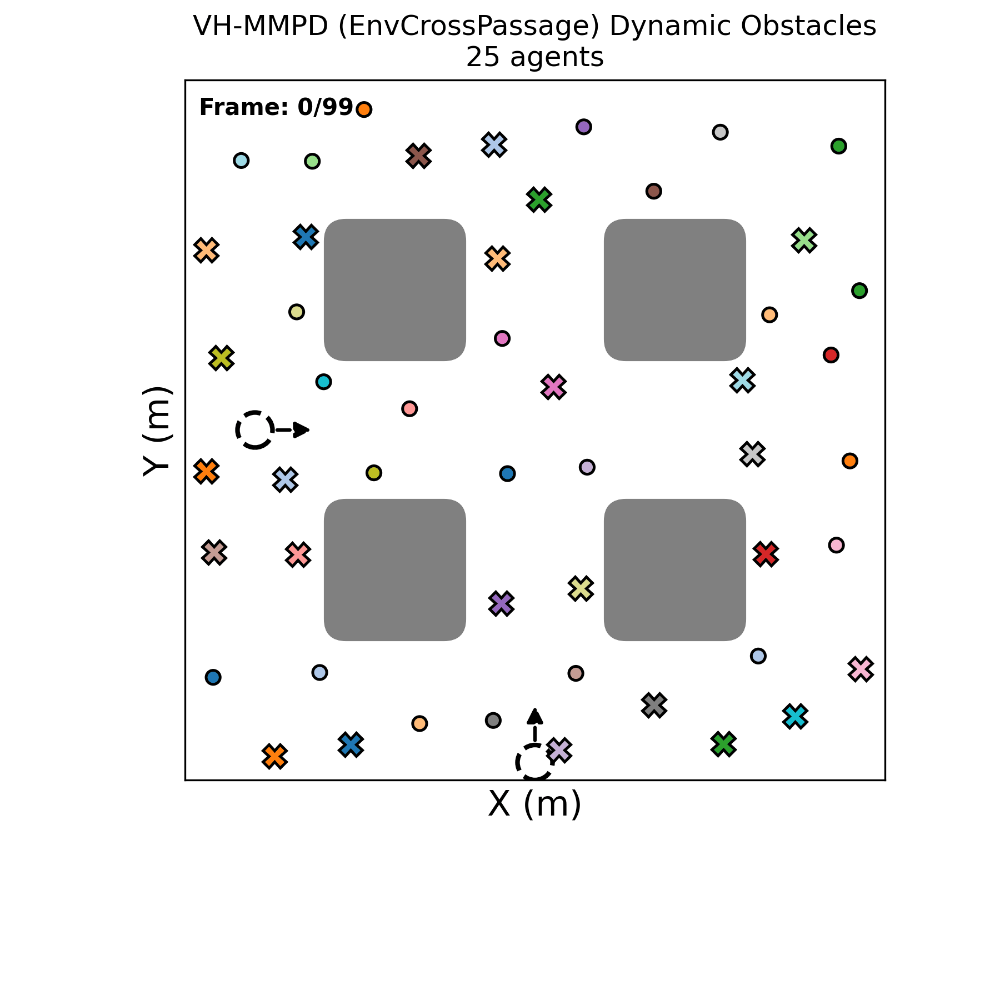
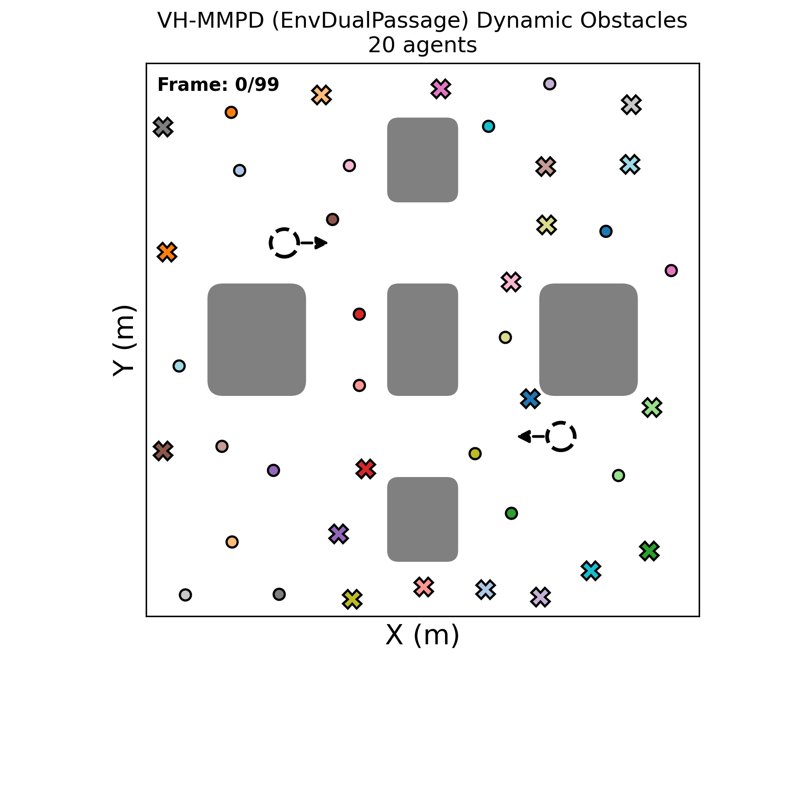
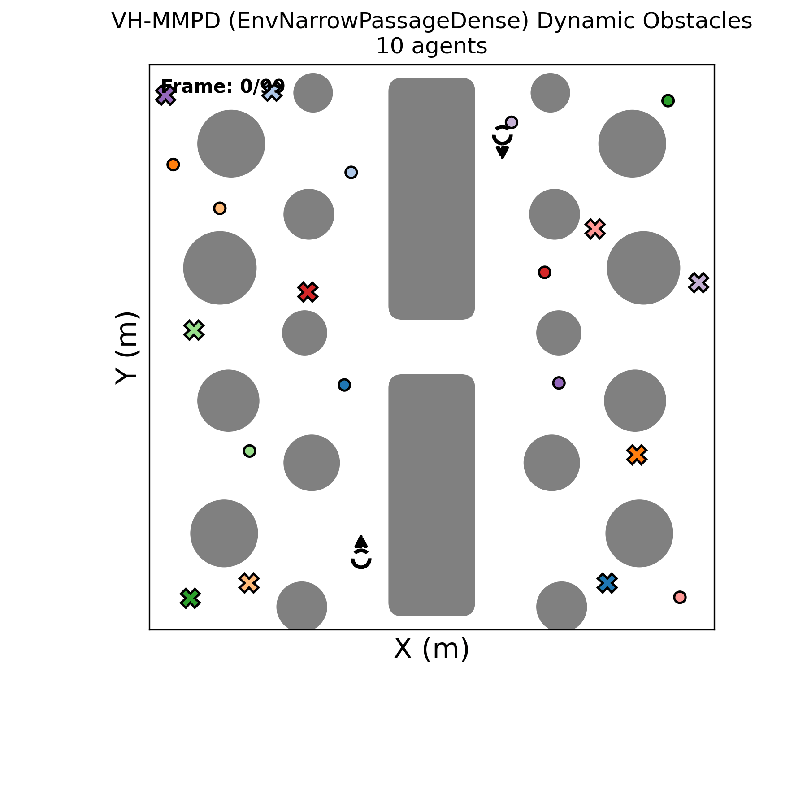

# Scalable Multiagent Motion Planning with Guided Diffusion Models

## Overview
**Variable-Horizon Multiagent Motion Planning Diffusion (VH-MMPD)** is a diffusion-based framework for scalable multi-agent motion planning with adaptive trajectory horizons. It combines a learned diffusion prior with gradient-based cost guidance for collision-free trajectory generation, and uses Gaussian Process Regression to predict suitable planning horizons for individual agents. 

**Title**: Scalable Multiagent Motion Planning with Guided Diffusion Models 

**Authors**: Hongyu Zhou, Zhonggang Li, Raj Thilak Rajan 

**Organizations**: Delft University of Technology 

Our source code will be publicly released upon acceptance of the paper. 

## Experimental Results
We show the full experimental results as supplementary materials for our paper. Pleass see the folder `figures`, where we put some examples of results, including the trajectories and corresponding animation. 

We compare our planner with other planners under different environments. 
Under the static-obstacle scenarios, VH-MMPD is compared with Multi-robot Motion Planning Diffusion Models (MMD), Prioritized Planning with A* (A*-PP), and discrete-RRT(dRRT). Since the real-world timestep is not required for A*-PP and dRRT, the arrival time (AT) metric is not available (N/A) for these planners. Under the dynamic-obstacle scenarios, VH-MMPD is compared with MMD. In the following tables, when success rate for some setting is 0, the corresponding metrics are not available. 

### Static-obstacle Scenarios

#### Empty

|  N | Method   |      SR ↑ |       PL ↓ |       S ↓ |       AT ↓ |      PT ↓ |
| -: | :------- | --------: | ---------: | --------: | ---------: | --------: |
|  3 | A*-PP    | **100.0** |     10.138 |     0.058 |        N/A | **0.217** |
|    | dRRT     | **100.0** |     21.323 |     0.473 |        N/A |     0.436 |
|    | MMD      | **100.0** |     10.265 |     0.051 |     29.477 |     1.484 |
|    | **Ours** | **100.0** |  **9.841** | **0.037** | **10.125** |     0.465 |
|  6 | A*-PP    | **100.0** |     10.586 |     0.057 |        N/A |     0.564 |
|    | dRRT     | **100.0** |     22.994 |     0.725 |        N/A | **0.477** |
|    | MMD      | **100.0** |     10.645 |     0.060 |     29.470 |     3.017 |
|    | **Ours** | **100.0** | **10.335** | **0.041** | **10.492** |     0.717 |
| 10 | A*-PP    | **100.0** |     10.573 |     0.059 |        N/A |     1.306 |
|    | dRRT     | **100.0** |     23.632 |     0.996 |        N/A |     0.601 |
|    | MMD      | **100.0** |     10.683 |     0.066 |     29.469 |     5.257 |
|    | **Ours** | **100.0** | **10.381** | **0.047** | **10.709** | **1.064** |
| 15 | A*-PP    | **100.0** |     10.559 |     0.061 |        N/A |     2.504 |
|    | dRRT     | **100.0** |     31.713 |     3.064 |        N/A |     2.476 |
|    | MMD      | **100.0** |     10.757 |     0.208 |     29.478 |     8.200 |
|    | **Ours** | **100.0** | **10.399** | **0.051** | **10.858** | **1.483** |
| 20 | A*-PP    | **100.0** |     10.878 |     0.064 |        N/A |     4.307 |
|    | dRRT     |      50.0 |     37.979 |     5.310 |        N/A |    30.497 |
|    | MMD      | **100.0** |     11.055 |     0.191 |     29.481 |    11.440 |
|    | **Ours** | **100.0** | **10.743** | **0.053** | **11.132** | **1.849** |
| 25 | A*-PP    | **100.0** |     10.996 | **0.066** |        N/A |     6.609 |
|    | dRRT     |       0.0 |         -- |        -- |        N/A |        -- |
|    | MMD      | **100.0** |     11.209 |     0.270 |     29.483 |    15.241 |
|    | **Ours** | **100.0** | **10.856** |     0.069 | **11.152** | **2.258** |

---

#### Sphere

|  N | Method   |      SR ↑ |       PL ↓ |       S ↓ |       AT ↓ |      PT ↓ |
| -: | :------- | --------: | ---------: | --------: | ---------: | --------: |
|  3 | A*-PP    | **100.0** | **10.507** |     0.080 |        N/A | **0.264** |
|    | dRRT     | **100.0** |     24.400 |     1.178 |        N/A |     0.429 |
|    | MMD      | **100.0** |     11.159 |     0.066 |     29.430 |     1.239 |
|    | **Ours** | **100.0** |     10.638 | **0.034** | **10.823** |     0.487 |
|  6 | A*-PP    | **100.0** | **10.862** |     0.083 |        N/A |     0.652 |
|    | dRRT     | **100.0** |     29.663 |     3.022 |        N/A | **0.524** |
|    | MMD      | **100.0** |     11.454 |     0.188 |     29.436 |     2.529 |
|    | **Ours** | **100.0** |     11.101 | **0.041** | **10.827** |     0.747 |
| 10 | A*-PP    | **100.0** | **11.080** |     0.086 |        N/A |     2.011 |
|    | dRRT     | **100.0** |     31.026 |     2.727 |        N/A |     1.097 |
|    | MMD      | **100.0** |     11.800 |     0.200 |     29.437 |     4.372 |
|    | **Ours** | **100.0** |     11.408 | **0.061** | **11.177** | **1.096** |
| 15 | A*-PP    | **100.0** | **11.241** |     0.090 |        N/A |     4.067 |
|    | dRRT     |    83.3 |     44.265 |     9.139 |        N/A |    23.425 |
|    | MMD      | **100.0** |     11.970 |     0.175 |     29.444 |     6.917 |
|    | **Ours** | **100.0** |     11.655 | **0.074** | **11.194** | **1.562** |
| 20 | A*-PP    | **100.0** | **11.450** | **0.094** |        N/A |     7.486 |
|    | dRRT     |      10.0 |     48.787 |    11.525 |        N/A |    45.975 |
|    | MMD      | **100.0** |     12.210 |     0.289 |     29.448 |     9.942 |
|    | **Ours** | **100.0** |     11.798 |     0.100 | **11.479** | **2.028** |
| 25 | A*-PP    | **100.0** | **11.548** | **0.096** |        N/A |    11.493 |
|    | dRRT     |       0.0 |         -- |        -- |        N/A |        -- |
|    | MMD      |    89.5 |     12.348 |     0.324 |     29.444 |    13.025 |
|    | **Ours** | **100.0** |     12.037 |     0.112 | **11.488** | **2.451** |

---

#### WarehousePassage

|  N | Method   |      SR ↑ |       PL ↓ |       S ↓ |       AT ↓ |      PT ↓ |
| -: | :------- | --------: | ---------: | --------: | ---------: | --------: |
|  3 | A*-PP    | **100.0** | **14.123** |     0.118 |        N/A |    11.496 |
|    | dRRT     | **100.0** |     41.119 |    12.006 |        N/A |     0.680 |
|    | MMD      |    93.3 |     15.113 |     0.121 |     29.531 |     1.249 |
|    | **Ours** | **100.0** |     15.068 | **0.092** | **14.497** | **0.471** |
|  6 | A*-PP    | **100.0** | **14.085** |     0.121 |        N/A |    31.215 |
|    | dRRT     |    83.3 |     60.633 |    50.207 |        N/A |     5.843 |
|    | MMD      |      90.0 |     15.553 |     1.256 |     29.521 |     2.562 |
|    | **Ours** | **100.0** |     15.156 | **0.114** | **14.349** | **0.721** |
| 10 | A*-PP    | **100.0** | **14.483** | **0.123** |        N/A |    73.705 |
|    | dRRT     |     6.7 |     61.322 |    30.859 |        N/A |    15.219 |
|    | MMD      |    83.3 |     15.797 |     1.785 |     29.518 |     4.525 |
|    | **Ours** |    90.0 |     15.593 |     0.149 | **14.778** | **1.059** |
| 15 | A*-PP    | **100.0** | **14.207** | **0.128** |        N/A |   138.899 |
|    | dRRT     |       0.0 |         -- |        -- |        N/A |        -- |
|    | MMD      |    66.7 |     15.535 |     2.748 |     29.519 |     7.349 |
|    | **Ours** |    73.3 |     14.968 |     0.199 | **14.224** | **1.496** |
| 20 | A*-PP    | **100.0** | **14.285** | **0.129** |        N/A |   221.212 |
|    | dRRT     |       0.0 |         -- |        -- |        N/A |        -- |
|    | MMD      |    44.8 |     16.228 |     8.193 |     29.520 |    10.878 |
|    | **Ours** |    43.3 |     14.893 |     0.169 | **14.174** | **1.937** |
| 25 | A*-PP    | **100.0** | **14.337** | **0.134** |        N/A |   340.128 |
|    | dRRT     |       0.0 |         -- |        -- |        N/A |        -- |
|    | MMD      |    37.9 |     16.788 |    21.887 |     29.524 |    16.620 |
|    | **Ours** |    16.7 |     14.716 |     0.192 | **13.352** | **2.333** |

---

#### CrossPassage

|  N | Method   |      SR ↑ |       PL ↓ |       S ↓ |       AT ↓ |      PT ↓ |
| -: | :------- | --------: | ---------: | --------: | ---------: | --------: |
|  3 | A*-PP    | **100.0** | **12.213** |     0.098 |        N/A |     0.712 |
|    | dRRT     | **100.0** |     28.081 |     1.985 |        N/A | **0.432** |
|    | MMD      | **100.0** |     13.025 |     0.113 |     29.523 |     1.221 |
|    | **Ours** | **100.0** |     12.731 | **0.045** | **11.526** |     0.489 |
|  6 | A*-PP    | **100.0** | **11.939** |     0.094 |        N/A |     1.796 |
|    | dRRT     | **100.0** |     36.761 |    30.482 |        N/A | **0.589** |
|    | MMD      | **100.0** |     12.774 |     0.107 |     29.519 |     2.529 |
|    | **Ours** | **100.0** |     12.272 | **0.045** | **11.510** |     0.751 |
| 10 | A*-PP    | **100.0** | **12.213** |     0.102 |        N/A |     5.950 |
|    | dRRT     | **100.0** |     42.547 |     9.430 |        N/A |     4.186 |
|    | MMD      | **100.0** |     13.293 |     0.241 |     29.521 |     4.353 |
|    | **Ours** | **100.0** |     12.544 | **0.049** | **11.836** | **1.100** |
| 15 | A*-PP    | **100.0** | **12.140** |     0.103 |        N/A |    11.878 |
|    | dRRT     |      70.0 |     49.074 |    13.519 |        N/A |    28.334 |
|    | MMD      |      96.3 |     13.304 |     0.975 |     29.513 |     7.001 |
|    | **Ours** | **100.0** |     12.542 | **0.077** | **11.582** | **1.581** |
| 20 | A*-PP    | **100.0** | **12.146** |     0.106 |        N/A |    20.194 |
|    | dRRT     |       0.0 |         -- |        -- |        N/A |        -- |
|    | MMD      |      92.3 |     14.065 |     9.220 |     29.515 |    11.325 |
|    | **Ours** | **100.0** |     12.500 | **0.101** | **11.389** | **2.034** |
| 25 | A*-PP    | **100.0** | **12.106** | **0.108** |        N/A |    31.527 |
|    | dRRT     |       0.0 |         -- |        -- |        N/A |        -- |
|    | MMD      |      82.6 |     13.971 |     4.607 |     29.514 |    13.473 |
|    | **Ours** |      77.8 |     12.448 |     0.125 | **11.229** | **2.252** |

---

#### DualPassage

|  N | Method   |      SR ↑ |       PL ↓ |       S ↓ |       AT ↓ |      PT ↓ |
| -: | :------- | --------: | ---------: | --------: | ---------: | --------: |
|  3 | A*-PP    | **100.0** | **11.567** |     0.086 |        N/A |     1.000 |
|    | dRRT     | **100.0** |     30.041 |     3.714 |        N/A | **0.442** |
|    | MMD      | **100.0** |     12.681 |     0.105 |     29.477 |     1.244 |
|    | **Ours** | **100.0** |     11.979 | **0.038** | **11.182** |     0.488 |
|  6 | A*-PP    | **100.0** | **12.143** |     0.095 |        N/A |     2.936 |
|    | dRRT     | **100.0** |     35.056 |     4.657 |        N/A | **0.574** |
|    | MMD      | **100.0** |     13.268 |     0.156 |     29.486 |     2.544 |
|    | **Ours** | **100.0** |     12.935 | **0.045** | **12.094** |     0.752 |
| 10 | A*-PP    | **100.0** | **12.105** |     0.095 |        N/A |     6.273 |
|    | dRRT     | **100.0** |     37.895 |     7.745 |        N/A |     2.007 |
|    | MMD      | **100.0** |     13.646 |     1.733 |     29.493 |     4.441 |
|    | **Ours** | **100.0** |     12.660 | **0.076** | **11.648** | **1.095** |
| 15 | A*-PP    | **100.0** | **11.964** | **0.096** |        N/A |    12.711 |
|    | dRRT     |      43.3 |     43.215 |     8.180 |        N/A |    30.844 |
|    | MMD      |      93.1 |     14.300 |     4.569 |     29.479 |     7.496 |
|    | **Ours** | **100.0** |     12.645 | **0.096** | **11.734** | **1.530** |
| 20 | A*-PP    | **100.0** | **11.987** | **0.097** |        N/A |    19.586 |
|    | dRRT     |       3.3 |     44.351 |     9.395 |        N/A |    21.859 |
|    | MMD      |      82.1 |     14.771 |     9.815 |     29.475 |    11.136 |
|    | **Ours** | **100.0** |     12.753 |     0.101 | **11.852** | **2.031** |
| 25 | A*-PP    | **100.0** | **12.118** | **0.102** |        N/A |    31.771 |
|    | dRRT     |       0.0 |         -- |        -- |        N/A |        -- |
|    | MMD      |      86.4 |     14.735 |    10.837 |     29.462 |    13.585 |
|    | **Ours** | **100.0** |     12.988 |     0.139 | **11.939** | **2.465** |

---

#### NarrowPassageDense

|  N | Method   |      SR ↑ |       PL ↓ |       S ↓ |       AT ↓ |       PT ↓ |
| -: | :------- | --------: | ---------: | --------: | ---------: | ---------: |
|  3 | A*-PP    | **100.0** | **12.312** |     0.140 |        N/A |      2.091 |
|    | dRRT     | **100.0** |     36.678 |     9.990 |        N/A |      0.480 |
|    | MMD      |      83.3 |     13.805 |     0.241 |     29.438 |      1.233 |
|    | **Ours** | **100.0** |     13.626 | **0.065** | **16.672** |  **0.452** |
|  6 | A*-PP    | **100.0** | **12.016** | **0.140** |        N/A |      5.591 |
|    | dRRT     | **100.0** |     47.293 |    22.228 |        N/A |      2.243 |
|    | MMD      |      50.0 |     13.041 |     0.382 |     29.341 |      2.522 |
|    | **Ours** | **100.0** |     13.500 |     0.194 | **16.495** |  **0.678** |
| 10 | A*-PP    | **100.0** | **12.388** |     0.151 |        N/A |     14.948 |
|    | dRRT     |      53.3 |     54.951 |    21.284 |        N/A |     27.540 |
|    | MMD      |      20.0 |     13.682 |     0.548 |     29.512 |      4.331 |
|    | **Ours** |    60.0 |     13.308 | **0.117** | **16.302** |  **0.987** |
| 15 | A*-PP    | **100.0** |     12.540 | **0.160** |        N/A |     30.920 |
|    | dRRT     |       0.0 |         -- |        -- |        N/A |         -- |
|    | MMD      |       3.3 |     13.738 |     0.684 |     29.469 |      7.302 |
|    | **Ours** |     6.7 | **12.386** |     0.167 | **14.758** |  **1.406** |
| 20 | A*-PP    | **100.0** | **12.561** | **0.165** |        N/A |     57.306 |
|    | dRRT     |       0.0 |         -- |        -- |        N/A |         -- |
|    | MMD      |       0.0 |         -- |        -- |         -- |         -- |
|    | **Ours** |       3.3 |     13.010 |     0.202 | **16.500** |  **1.837** |
| 25 | A*-PP    | **100.0** |     12.622 |     0.174 |        N/A | **95.147** |
|    | dRRT     |       0.0 |         -- |        -- |        N/A |         -- |
|    | MMD      |       0.0 |         -- |        -- |         -- |         -- |
|    | **Ours** |       0.0 |         -- |        -- |         -- |         -- |

### Dynamic-obstacle Scenarios

The trajectories of circular dynamic obstacles are assumed to be known. We put animated GIF examples for different dynamic-obstacle environments below. The colored circles are the agents and cross markers are their goal positions. The gray shapes denote the static obstacles, while the hollow circles refer to the dynamic obstacles. 

#### Empty

|  N | Method   |      SR ↑ |       PL ↓ |       S ↓ |       AT ↓ |      PT ↓ |
| -: | :------- | --------: | ---------: | --------: | ---------: | --------: |
|  3 | MMD      | **100.0** |     11.073 |     0.690 |     29.503 |     1.201 |
|    | **VH-MMPD** | **100.0** |  **9.799** | **0.086** | **10.492** | **0.511** |
|  6 | MMD      | **100.0** |     11.738 |     0.592 |     29.501 |     2.452 |
|    | **VH-MMPD** | **100.0** | **10.478** | **0.087** | **10.983** | **0.679** |
| 10 | MMD      | **100.0** |     12.144 |     1.152 |     29.502 |     4.309 |
|    | **VH-MMPD** | **100.0** | **10.711** | **0.082** | **10.844** | **0.983** |
| 15 | MMD      | **100.0** |     12.113 |     1.156 |     29.491 |     6.937 |
|    | **VH-MMPD** | **100.0** | **10.773** | **0.086** | **11.040** | **1.378** |
| 20 | MMD      | **100.0** |     12.633 |     2.354 |     29.494 |     9.892 |
|    | **VH-MMPD** | **100.0** | **10.885** | **0.092** | **11.128** | **1.782** |
| 25 | MMD      | **100.0** |     13.090 |     2.640 |     29.497 |    13.384 |
|    | **VH-MMPD** |      96.7 | **11.071** | **0.133** | **11.385** | **2.250** |

---

### Sphere

|  N | Method   |      SR ↑ |       PL ↓ |       S ↓ |       AT ↓ |      PT ↓ |
| -: | :------- | --------: | ---------: | --------: | ---------: | --------: |
|  3 | MMD      | **100.0** |     12.113 |     0.411 |     29.448 |     1.255 |
|    | **VH-MMPD** | **100.0** | **11.161** | **0.070** | **11.039** | **0.550** |
|  6 | MMD      |      90.0 |     12.758 |     0.925 |     29.450 |     2.587 |
|    | **VH-MMPD** | **100.0** | **11.818** | **0.060** | **11.341** | **0.788** |
| 10 | MMD      |      82.1 |     12.892 |     1.889 |     29.451 |     4.490 |
|    | **VH-MMPD** | **100.0** | **11.648** | **0.109** | **11.395** | **1.141** |
| 15 | MMD      |      63.0 |     13.745 |     6.076 |     29.452 |     7.359 |
|    | **VH-MMPD** | **100.0** | **11.764** | **0.129** | **11.298** | **1.619** |
| 20 | MMD      |      38.5 |     13.935 |     4.672 |     29.454 |    10.470 |
|    | **VH-MMPD** | **100.0** | **11.961** | **0.151** | **11.408** | **2.079** |
| 25 | MMD      |      15.0 |     14.648 |     6.259 |     29.472 |    14.463 |
|    | **VH-MMPD** |  **92.0** | **12.326** | **0.251** | **11.544** | **2.545** |

---

### WarehousePassage

|  N | Method   |      SR ↑ |       PL ↓ |       S ↓ |       AT ↓ |      PT ↓ |
| -: | :------- | --------: | ---------: | --------: | ---------: | --------: |
|  3 | MMD      | **100.0** |     15.667 |     0.636 |     29.518 |     1.241 |
|    | **VH-MMPD** | **100.0** | **15.530** | **0.078** | **14.818** | **0.524** |
|  6 | MMD      |      86.7 |     16.155 |     1.705 |     29.524 |     2.579 |
|    | **VH-MMPD** | **100.0** | **15.878** | **0.127** | **14.695** | **0.752** |
| 10 | MMD      |      76.7 |     16.352 |     2.008 |     29.516 |     4.513 |
|    | **VH-MMPD** |  **83.3** | **15.664** | **0.179** | **15.018** | **1.089** |
| 15 | MMD      |      40.0 |     16.235 |     3.101 |     29.522 |     7.308 |
|    | **VH-MMPD** |  **63.3** | **15.025** | **0.248** | **14.429** | **1.542** |
| 20 | MMD      |      22.2 |     15.296 |     2.968 |     29.521 |    10.427 |
|    | **VH-MMPD** |  **26.7** | **14.787** | **0.222** | **13.966** | **1.980** |
| 25 | MMD      |      12.5 |     14.499 |     2.175 |     29.528 |    14.002 |
|    | **VH-MMPD** |  **16.7** | **14.873** | **0.252** | **13.926** | **2.413** |

---

### CrossPassage

|  N | Method   |      SR ↑ |       PL ↓ |       S ↓ |       AT ↓ |      PT ↓ |
| -: | :------- | --------: | ---------: | --------: | ---------: | --------: |
|  3 | MMD      | **100.0** |     13.353 |     0.602 |     29.516 |     1.257 |
|    | **VH-MMPD** | **100.0** | **12.682** | **0.068** | **12.122** | **0.534** |
|  6 | MMD      |      90.0 |     13.714 |     1.196 |     29.520 |     2.561 |
|    | **VH-MMPD** | **100.0** | **12.431** | **0.075** | **11.733** | **0.782** |
| 10 | MMD      |      82.8 |     13.490 |     2.565 |     29.511 |     4.480 |
|    | **VH-MMPD** |  **96.7** | **11.971** | **0.101** | **11.132** | **1.131** |
| 15 | MMD      |      60.7 |     13.313 |     3.423 |     29.515 |     7.238 |
|    | **VH-MMPD** |  **96.7** | **11.864** | **0.119** | **10.895** | **1.617** |
| 20 | MMD      |      35.7 |     14.475 |     7.745 |     29.511 |    10.623 |
|    | **VH-MMPD** | **100.0** | **12.013** | **0.120** | **11.048** | **2.086** |
| 25 | MMD      |      20.0 |     15.001 |    30.990 |     29.509 |    22.345 |
|    | **VH-MMPD** |  **92.9** | **12.209** | **0.182** | **11.301** | **2.551** |

---

### DualPassage

|  N | Method   |      SR ↑ |       PL ↓ |       S ↓ |       AT ↓ |      PT ↓ |
| -: | :------- | --------: | ---------: | --------: | ---------: | --------: |
|  3 | MMD      | **100.0** |     14.745 |     2.796 |     29.487 |     1.253 |
|    | **VH-MMPD** | **100.0** | **12.509** | **0.101** | **12.281** | **0.541** |
|  6 | MMD      |      96.6 |     15.436 |     5.135 |     29.498 |     2.580 |
|    | **VH-MMPD** | **100.0** | **12.616** | **0.115** | **11.982** | **0.787** |
| 10 | MMD      |      89.3 |     15.889 |     7.198 |     29.493 |     4.744 |
|    | **VH-MMPD** |  **93.3** | **12.478** | **0.133** | **11.810** | **1.138** |
| 15 | MMD      |      78.6 |     17.652 |    14.119 |     29.496 |     7.943 |
|    | **VH-MMPD** |  **93.3** | **12.673** | **0.133** | **11.902** | **1.608** |
| 20 | MMD      |      66.7 |     19.790 |    91.807 |     29.498 |    14.748 |
|    | **VH-MMPD** |  **83.3** | **12.847** | **0.166** | **11.950** | **2.078** |
| 25 | MMD      |      23.1 |     18.536 |    52.398 |     29.488 |    19.077 |
|    | **VH-MMPD** |  **62.1** | **12.860** | **0.315** | **11.907** | **2.526** |

---

### NarrowPassageDense

|  N | Method   |     SR ↑ |       PL ↓ |       S ↓ |       AT ↓ |      PT ↓ |
| -: | :------- | -------: | ---------: | --------: | ---------: | --------: |
|  3 | MMD      | **93.1** |     15.331 |     1.110 |     29.497 |     1.211 |
|    | **VH-MMPD** |     86.7 | **13.898** | **0.303** | **16.758** | **0.545** |
|  6 | MMD      |     55.6 |     15.229 |     1.476 |     29.497 |     2.490 |
|    | **VH-MMPD** | **70.0** | **14.722** | **0.403** | **17.251** | **0.786** |
| 10 | MMD      |     20.7 |     15.568 |     2.127 |     29.512 |     4.356 |
|    | **VH-MMPD** | **36.7** | **13.554** | **0.288** | **16.310** | **1.138** |
| 15 | MMD      |      0.0 |         -- |        -- |         -- |        -- |
|    | **VH-MMPD** |  **3.3** | **13.651** | **0.283** | **17.062** | **1.610** |
| 20 | MMD      |      0.0 |         -- |        -- |         -- |        -- |
|    | **VH-MMPD** |      0.0 |         -- |        -- |         -- |        -- |
| 25 | MMD      |      0.0 |         -- |        -- |         -- |        -- |
|    | **VH-MMPD** |      0.0 |         -- |        -- |         -- |        -- |

